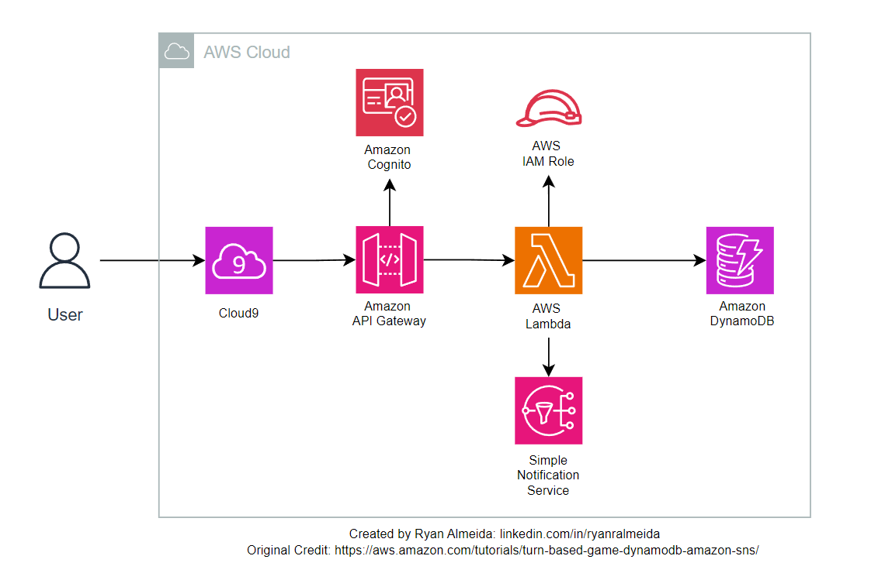

# Build a Turn Based Game using AWS

## Project Description:
This project is an example built alongside an AWS Tutorial (https://aws.amazon.com/tutorials/turn-based-game-dynamodb-amazon-sns/) that allows you to build a multiplayer, turn-based game called Nim using Amazon DynamoDB and the Amazon Simple Notification System (SNS) 

The Nim game is a mathematical game of strategy where two players take turns removing objects from heaps. The objective is to avoid being the player who takes the last object.

This project serves as an introductory exploration of event-driven architecture as well as serverless computing. This project allows you to: 

- Leverage DynamoDB as the durable system of record to store the game state
- Use AWS Lambda to package and execute the function code without the need to configure the underlying resources
- Utilizing API Gateway and Lambda to handle various HTTP-based API calls
- Implementing Amazon SNS for SMS messaging to alert your users of important events in the game
- Integrating Amazon Cognito for user registration and authentication
- Working with Cloud9 as the cloud-based IDE to execute and interact with the program code

## Architecture Diagram:

## Components Description:

| Component     | Functionality |
| ------------- | ------------- |
| DynamoDB      | Acts as the primary data storage for the game, storing game states, player information, and move historyStores the product catalog; provides a durable, scalable NoSQL database for managing item data  |
| Amazon SNS | Sends SMS alerts to users about critical game events, such as when it’s their turn or when a game ends |
| Amazon Cognito  |Manages user registration, authentication, and access control |
| AWS Lambda  |Executes the game logic, processing each move and determining the game state after every turn|
| API Gateway  |Provides in-memory caching to quickly retrieve best sellers list and other frequently accessed data.  |
|API Gateway  | Exposes the Lambda functions through HTTP-based endpoints, allowing users to interact with the game via RESTful APIs |
|AWS Cloud9 | Serves as the cloud-based integrated development environment (IDE) for coding, debugging, and interacting with the project|

## Functional Requirements:
- User Registration & Authentication: Users must be able to sign up, log in, and authenticate themselves.
- Game Creation: Users should be able to start a new game
- Player Turns: The system should manage turns, allowing players to make moves until the game concludes.
- SMS Notifications: Players should receive SMS notifications for game events like turn notifications and game results.
- Game Logic Execution: The application should process each move and determine the next state of the game.

## Non-Functional Requirements:
- Scalability: The system must handle a large number of concurrent games without performance degradation, leveraging the serverless capabilities of AWS services.
- Security: Data and user interactions must be secured using IAM roles and Cognito, ensuring only authorized access to game functions and data.
- Availability: The system should be highly available, with minimal downtime, to allow users to play games at any time.
- Performance: The game must respond to user actions in real-time, with Lambda functions executing logic within milliseconds.
- Cost-Effectiveness: The system should optimize the use of AWS services to minimize costs, utilizing on-demand scaling and serverless architecture

